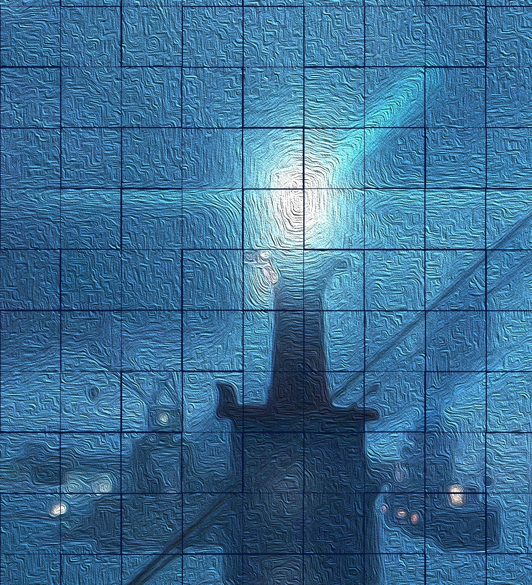

# Minesweeper 1980

# Overview

Minesweeper is a single-player puzzle game. The objective is to clear a rectangular board containing hidden mines without detonating any of them. The game originates from the 1960s, and has been written for most computing platforms in use today.

Instead of trying to look like one of the original implementations, this version employs stock iOS controls, uses emoji for most graphic elements, a tab bar for navigation, and supports display rotation. 

Other features include:

- Customizable game board dimensions and mine/flag count
- Mutable sound effects and background "music"
- Full undo history
- Optional safe-first-move

Minesweeper (1980) is free software: you can redistribute it and/or modify it under the terms of the MIT License as published by the Free Software Foundation. You should have received a copy of the MIT License along with this program. If not, see <https://opensource.org/licenses/MIT>

Installation is currently available through the App Store. That isn't always the case, depending on whether I've paid my Apple Developer dues.

